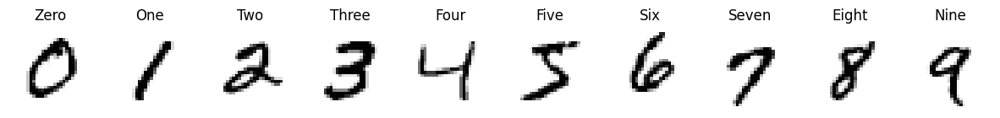
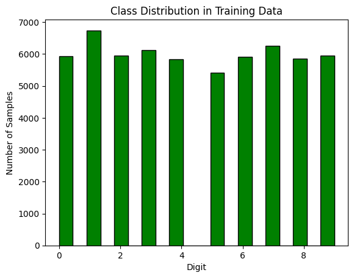
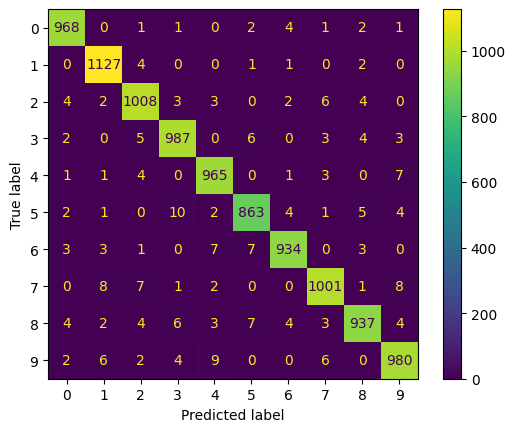
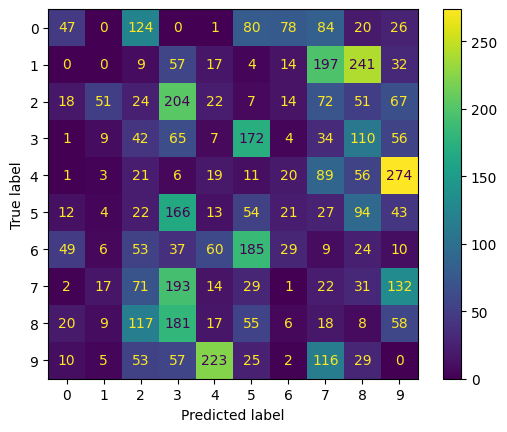

# MNIST Neural Network with Adversarial Attacks

This project demonstrates a neural network trained on the MNIST dataset using TensorFlow and Keras, with the incorporation of adversarial attacks such as FGSM (Fast Gradient Sign Method) and PGD (Projected Gradient Descent) to explore how adversarial examples affect model performance.

## Project Overview

- **Dataset**: MNIST dataset consisting of 60,000 training images and 10,000 test images of handwritten digits (0-9).
<p align="center">
  
</p>
 <p align="center"> 
  
</p>
- **Model**: A fully connected neural network with three hidden layers trained on the MNIST dataset.
- **Adversarial Attacks**:
  - **FGSM (Fast Gradient Sign Method)**: This attack perturbs the input images by adding small but intentional noise to make the model misclassify.
  - **PGD (Projected Gradient Descent)**: An iterative method that applies small perturbations over multiple steps to create adversarial samples.
  
## Model Architecture

- **Input Layer**: 784 units (flattened 28x28 grayscale images).
- **Hidden Layer 1**: 512 units with ReLU activation.
- **Hidden Layer 2**: 128 units with ReLU activation.
- **Hidden Layer 3**: 32 units with ReLU activation.
- **Output Layer**: 10 units with softmax activation (one for each digit).

## Results

### Training and Validation
- **Accuracy**: The model achieved high accuracy on the original MNIST test dataset.
- **Adversarial Evaluation**: Accuracy dropped significantly when subjected to adversarial attacks (FGSM, PGD).

### Confusion Matrix
- A confusion matrix is plotted for both clean and adversarial test data, showing the classification performance.
<p align="center">
  
  
</p>

## Adversarial Attacks

1. **Fast Gradient Sign Method (FGSM)**:
   - Perturbations are added to the input image based on the gradient of the loss with respect to the input.
   - Generates adversarial examples in a single step.

2. **Projected Gradient Descent (PGD)**:
   - Iteratively applies FGSM to craft stronger adversarial examples by making small updates in each iteration.

## Dependencies

This project requires the following Python packages:
```bash
tensorflow
keras
matplotlib
numpy
scikit-learn
