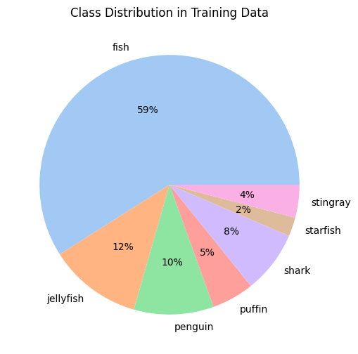
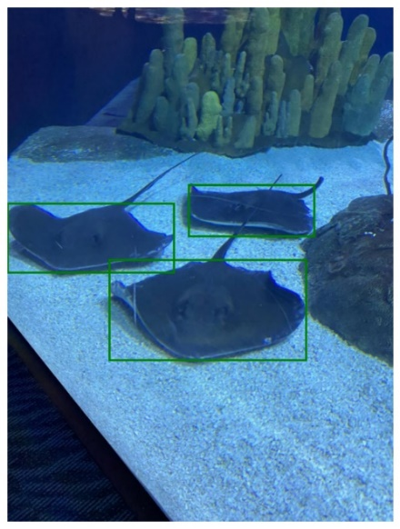

# Faster R-CNN Object Detection on Aquarium Dataset

This project implements **Faster R-CNN** for object detection on the **Aquarium Dataset** using PyTorch. The model is trained to detect seven different marine creatures, including fish, jellyfish, and sharks. The dataset consists of images with corresponding bounding boxes stored in YOLO format.

## Table of Contents
- [Dataset](#dataset)
- [Model Overview](#model-overview)
- [Installation & Setup](#installation--setup)
- [Training the Model](#training-the-model)
- [Evaluation & Visualization](#evaluation--visualization)
- [Loss Function & Training Results](#loss-function--training-results)
- [References](#references)

---

## Dataset
The dataset is structured as follows:

```
/aquarium-data-cots/
│── aquarium_pretrain/
    ├── train/
        ├── images/  # Training images
        ├── labels/  # Corresponding YOLO format labels
    ├── valid/
        ├── images/  # Validation images
        ├── labels/  # Corresponding labels
    ├── test/
        ├── images/  # Test images
        ├── labels/  # Corresponding labels
```
<p align="center">
  
  
</p>
Each label file contains bounding box annotations in **YOLO format**:
```
<class_id> <x_center> <y_center> <width> <height>
```
where all values are normalized between `[0,1]`.

---

## Model Overview
This project uses **Faster R-CNN** for object detection, with **ResNet-101** as the feature extractor.

### Key Components:
- **Backbone:** A pre-trained **ResNet-101** is used to extract high-level features.
- **Region Proposal Network (RPN):** Generates candidate bounding boxes (anchors).
- **ROI Pooling:** Extracts features for each proposed region.
- **Bounding Box Regression & Classification:** Predicts final object locations and labels.

We use the **Generalized IoU (GIoU) loss** for better box regression accuracy.

---

## Installation & Setup

### Requirements:
- Python 3.x
- PyTorch
- torchvision
- PIL (Pillow)
- Matplotlib
- Pandas

### Install Dependencies:
```sh
pip install torch torchvision numpy pandas matplotlib pillow
```

### Run the Code:
```sh
python train.py
```
Make sure the dataset path is correctly set in the script.

---

## Training the Model
The training loop includes:
- **Data Loading:** Custom PyTorch Dataset loads images and YOLO-style labels.
- **Preprocessing:** Normalization and resizing are applied.
- **Training Loop:** 
  - The model is trained using **Stochastic Gradient Descent (SGD)**.
  - Loss is computed as a sum of **classification loss and bounding box regression loss**.
  - Training runs for **20 epochs**.

#### Training Hyperparameters:
| Parameter | Value |
|-----------|-------|
| Optimizer | SGD |
| Learning Rate | 0.005 |
| Momentum | 0.9 |
| Weight Decay | 0.0005 |
| Batch Size | 1 |
| Epochs | 20 |

---

## Evaluation & Visualization
After training, the model is evaluated on test images.

- **Detection Results:** The model predicts bounding boxes and class labels.
- **Visualization:** Bounding boxes are plotted on test images.

```python
evaluate_and_visualize(model, device, test_img, class_names, threshold=0.2)
```

Sample output:
```
Box: [50, 30, 200, 150], Label: Fish, Score: 0.85
Box: [100, 60, 250, 200], Label: Jellyfish, Score: 0.78
```


---

## Loss Function & Training Results
We track both **training loss** and **validation loss** over epochs.

### Loss Components:
- **Classification Loss** (CrossEntropy)
- **Bounding Box Regression Loss** (Smooth L1)
- **GIoU Loss** (Improves box localization)

### Training Loss Plot:
```python
plt.plot(epochs, train_losses, 'b', label='Training loss')
plt.plot(epochs, val_losses, 'r', label='Validation loss')
plt.title('Training and Validation Loss')
plt.xlabel('Epochs')
plt.ylabel('Loss')
plt.legend()
plt.show()
```
The loss should gradually decrease, indicating successful training.

---

## References
- [Faster R-CNN Paper](https://arxiv.org/abs/1506.01497)
- [PyTorch Faster R-CNN](https://pytorch.org/vision/stable/models/generated/torchvision.models.detection.fasterrcnn_resnet50_fpn.html)

---

