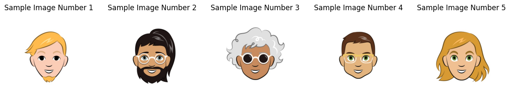
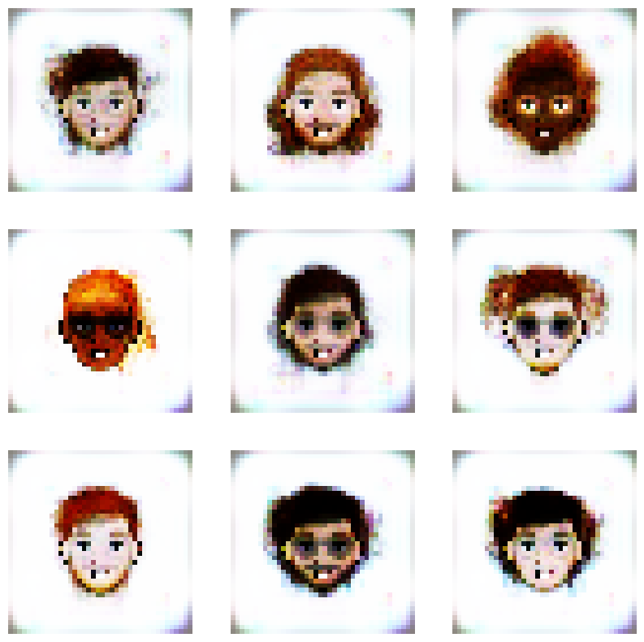

# Variational Autoencoder (VAE) for Cartoon Face Generation

## Overview
This repository contains a PyTorch implementation of a Variational Autoencoder (VAE) trained on the Google Cartoon Set dataset. The model is designed to encode and decode cartoon face images, learning a lower-dimensional latent representation.

## Dataset
The dataset used is the **Google Cartoon Set**, available on Kaggle:
[Cartoon Faces - Google's Cartoon Set](https://www.kaggle.com/datasets)
<p align="center">
  
</p>
Images are loaded from the dataset, preprocessed, and used for training the VAE model.

## Dependencies
Ensure you have the following dependencies installed:
```bash
pip install torch torchvision numpy pandas matplotlib
```

## Code Structure
- `image_paths()`: Generates full paths for images in the dataset.
- `plot_sample()`: Displays a sample of images from the dataset.
- `VAE` class: Defines the Variational Autoencoder model.
- `CustomDataset` class: Custom dataset class for loading images.
- `train_model()`: Training function for the VAE.
- `decoder_img()`: Decodes a latent vector into an image.
- `plot()`: Plots training loss curves.

## Model Architecture
The VAE consists of:
- **Encoder**: A series of convolutional layers that reduce the image to a latent space representation.
- **Latent Space**: A compressed representation of the input image.
- **Decoder**: A series of transposed convolutional layers to reconstruct the image.

---

## **How the Model Works**  
### **Variational Autoencoder (VAE)**  
A **VAE** is a generative model that learns to encode input images into a compressed latent space and then reconstructs them. The key difference from a standard Autoencoder is that a VAE learns a probability distribution over the latent space, which allows us to generate new data points by sampling from this distribution.

### **Architecture Overview**  
The model consists of three main components:  

#### **1. Encoder**  
The encoder takes an input image and compresses it into a lower-dimensional latent space. It consists of:  
- **Four convolutional layers** with BatchNorm and ReLU activations.  
- A **fully connected layer** that maps the feature maps to a latent representation.  
- Two separate layers to generate the **mean (μ)** and **log-variance (σ²)** of the latent distribution.  

#### **2. Latent Space Representation**  
The **latent vector (z)** is sampled from a Gaussian distribution using the **reparameterization trick**:  

\[
z = \mu + \epsilon \cdot e^{\frac{\sigma}{2}}
\]

where \( \epsilon \) is a random noise vector sampled from a normal distribution.

#### **3. Decoder**  
The decoder reconstructs the image from the latent vector. It consists of:  
- Two fully connected layers to map the latent space back to an image representation.  
- **Five transposed convolutional layers** to upsample the compressed representation and generate the final output image.  
- The final activation function is **Sigmoid**, ensuring pixel values are between 0 and 1.  

### **Loss Function**  
The training process minimizes the **VAE loss**, which consists of:  
1. **Reconstruction Loss** (Mean Squared Error - MSE)  
   - Ensures that the reconstructed image is similar to the input image.  
2. **KL Divergence Loss**  
   - Ensures the latent space follows a normal distribution, allowing smooth interpolation between generated images.  

The total loss is given by:

\[
\mathcal{L} = \text{Reconstruction Loss} + \lambda \times \text{KL Divergence}
\]

where \( \lambda \) is a weighting factor (in this case, 1.5).  

---
## Training
The model is trained using the **Mean Squared Error (MSE) loss** combined with a **Kullback-Leibler (KL) divergence loss**.

To train the model:
```python
optimizer = optim.Adam(model_cartoon.parameters(), lr=2e-6)
criterion = F.mse_loss
train_losses_epoch, train_losses_recon = train_model(model_cartoon, dataloader_cartoon, optimizer, criterion, device, num_epochs=5)
```

## Saving & Loading the Model
After training, the model can be saved and loaded using:
```python
torch.save(model_cartoon.state_dict(), 'model_scripted.pt')
```

## Generating New Images
To generate an image from a latent vector:
```python
z = torch.rand(35).to(device)*-1.9 + torch.exp(1*b[0]/2)
decoder_img(model_cartoon, z, device)
```
This will produce a new cartoon face from the learned latent distribution.
<p align="center">
  
</p>

## Results
Training loss is plotted using:
```python
plot(num_epochs, train_losses_epoch, train_losses_recon)
```
<p align="center">
  
  
</p>

## Acknowledgments
- **Kaggle** for providing the dataset.
- **PyTorch** for deep learning frameworks.

## License
This project is licensed under the MIT License.

